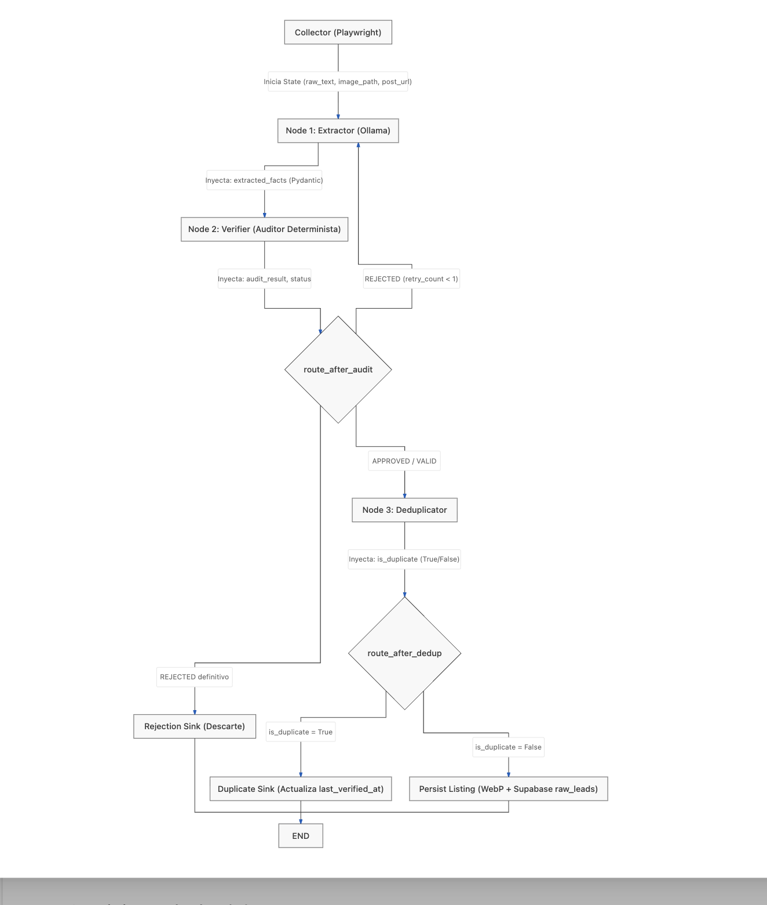

# Agentic Pipeline Visualizer ⚡

> **Interactive runtime telemetry and state-machine inspector for autonomous LangGraph pipelines.**

A minimalist, high-performance Single Page Application (SPA) designed to visualize and inspect deterministic state transitions, multimodal extraction, self-correction reflection loops, and idempotent persistence sinks in real-time.



---

## 🛠️ Key Architectural Pillars

* **State Machine Modeling (LangGraph):** Finite State Machine (FSM) orchestrating asynchronous nodes with immutable typed state dictionaries.
* **Deterministic Guardrails (Pydantic):** Strict schema contract auditing preventing unvalidated payloads from propagating down the DAG.
* **Self-Correction Reflection Loop:** Conditional edges evaluating validation violations and re-routing targeted feedback back to extraction nodes.
* **Idempotent Persistence Sink:** Content fingerprinting preventing duplicate writes to relational/event sinks (`Supabase raw_events`).
* **Zero Marginal Inference Cost:** Built for local model inference serving (`Ollama`) with hardware acceleration.

---

## 🔬 State Inspection Schema

The visualizer steps through immutable state mutations across 6 execution phases:

1. **Ingestion & State Initialization:** Wrapping `raw_payload` with runtime envelopes and metadata.
2. **Local Multimodal Extraction:** Generating `extracted_candidate` semantic projections.
3. **Deterministic Schema Audit (Failed):** Capturing schema violations and bound errors via `PydanticSchemaVerifier`.
4. **Self-Correction Loop:** Triggering conditional reflection edge (`retry_count < max_retries`).
5. **Audit Passed:** Validated payload fulfilling `schema_signature` constraint with 0.98 confidence.
6. **Idempotent Persistence:** Transactional commit to `persistence_sink` (`is_duplicate: false`).

---

## 🚀 Getting Started

### Prerequisites
* Node.js `>= 18.0.0`
* npm `>= 9.0.0`

### Installation
```bash
git clone https://github.com/Liliana99/agentic-pipeline-visualizer.git
cd agentic-pipeline-visualizer
npm install
```

### Development
```bash
npm run dev
```

### Production Build
```bash
npm run build
```

---

## 🌐 Automated GitHub Pages Deployment

The repository includes a pre-configured GitHub Actions workflow in [`.github/workflows/deploy.yml`](.github/workflows/deploy.yml).

Every commit pushed to the `main` branch automatically builds the Vite bundle and deploys the static assets to GitHub Pages.

### Enabling GitHub Pages in Repository Settings:
1. Go to **Settings** > **Pages** in your GitHub repository.
2. Under **Build and deployment** > **Source**, select **GitHub Actions**.

---

## 📄 License
MIT License.